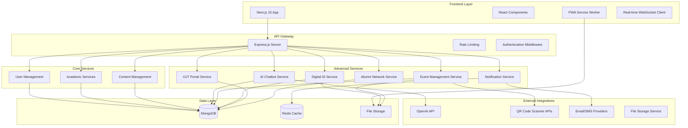

# Design Document: Advanced Modern Features

## Overview

This document outlines the technical design for implementing Phase 5 advanced features that will transform the PCC Portal into an international-level school management system. The design leverages modern web technologies, AI integration, QR code systems, and real-time communication to create a comprehensive digital ecosystem for education.

The system will extend the existing Next.js/Node.js/MongoDB architecture with new microservices, AI integration, real-time capabilities, and mobile-optimized interfaces while maintaining security, scalability, and performance standards.

## Architecture

### High-Level Architecture



### Technology Stack Extensions

**Frontend Enhancements:**
- Progressive Web App (PWA) capabilities for offline access
- WebSocket integration for real-time notifications
- Camera API integration for QR code scanning
- Service Workers for background sync and caching
- Push Notification API for mobile alerts

**Backend Extensions:**
- Socket.io for real-time communication
- OpenAI API integration for chatbot intelligence
- QR code generation and validation libraries
- Background job processing with Bull Queue
- Redis for caching and session management

**New Dependencies:**
- `socket.io` - Real-time bidirectional communication
- `openai` - AI chatbot integration
- `qrcode` - QR code generation (already installed)
- `jsqr` - QR code scanning
- `bull` - Background job processing
- `redis` - Caching and session store
- `node-cron` - Scheduled tasks
- `nodemailer` - Email notifications
- `twilio` - SMS notifications

## Components and Interfaces

### 1. AI-Powered Chatbot System

#### Architecture Components

**Frontend Components:**
```typescript
// ChatWidget.tsx - Floating chat interface
interface ChatWidgetProps {
  isOpen: boolean;
  onToggle: () => void;
  userId?: string;
}

// ChatMessage.tsx - Individual message component
interface ChatMessageProps {
  message: ChatMessage;
  isBot: boolean;
  timestamp: Date;
}

// ChatInput.tsx - Message input with typing indicators
interface ChatInputProps {
  onSendMessage: (message: string) => void;
  isTyping: boolean;
}
```

**Backend Services:**
```javascript
// ChatbotService.js - Core AI integration
class ChatbotService {
  async processMessage(message, userId, context) {
    // Process natural language input
    // Query knowledge base
    // Generate contextual response
    // Log conversation for analytics
  }
  
  async trainOnFAQs(faqData) {
    // Update AI model with new FAQ data
  }
  
  async escalateToHuman(conversationId, reason) {
    // Transfer conversation to human support
  }
}

// KnowledgeBase.js - FAQ and information management
class KnowledgeBase {
  async searchRelevantInfo(query) {
    // Vector search through FAQ database
    // Return relevant information chunks
  }
  
  async updateKnowledge(category, content) {
    // Add new information to knowledge base
  }
}
```

**Data Models:**
```javascript
// ChatConversation Schema
const chatConversationSchema = new mongoose.Schema({
  userId: { type: mongoose.Schema.Types.ObjectId, ref: 'User' },
  sessionId: { type: String, required: true, index: true },
  messages: [{
    content: { type: String, required: true },
    sender: { type: String, enum: ['user', 'bot', 'human'], required: true },
    timestamp: { type: Date, default: Date.now },
    confidence: { type: Number, min: 0, max: 1 },
    intent: { type: String },
    entities: [{ type: String, value: String }]
  }],
  status: { type: String, enum: ['active', 'resolved', 'escalated'], default: 'active' },
  escalatedTo: { type: mongoose.Schema.Types.ObjectId, ref: 'User' },
  satisfaction: { type: Number, min: 1, max: 5 },
  tags: [String],
  language: { type: String, default: 'en' }
}, { timestamps: true });

// FAQ Knowledge Base Schema
const faqSchema = new mongoose.Schema({
  question: { type: String, required: true, index: 'text' },
  answer: { type: String, required: true },
  category: { type: String, required: true, index: true },
  keywords: [String],
  priority: { type: Number, default: 1 },
  isActive: { type: Boolean, default: true },
  usage_count: { type: Number, default: 0 },
  last_updated: { type: Date, default: Date.now }
});
```

### 2. Event Ticketing System

#### Architecture Components

**Frontend Components:**
```typescript
// EventList.tsx - Display available events
interface EventListProps {
  events: Event[];
  onRegister: (eventId: string) => void;
  userRole: string;
}

// EventRegistration.tsx - Registration form
interface EventRegistrationProps {
  event: Event;
  onSubmit: (registrationData: RegistrationData) => void;
}

// DigitalTicket.tsx - QR ticket display
interface DigitalTicketProps {
  ticket: Ticket;
  onDownload: () => void;
  onShare: () => void;
}

// QRScanner.tsx - Attendance scanning
interface QRScannerProps {
  onScan: (ticketData: string) => void;
  eventId: string;
}
```

**Backend Services:**
```javascript
// EventService.js - Event management
class EventService {
  async createEvent(eventData, organizerId) {
    // Create event with capacity management
    // Generate unique event codes
    // Set up registration workflows
  }
  
  async registerForEvent(eventId, userId, registrationData) {
    // Check capacity and prerequisites
    // Generate unique QR ticket
    // Send confirmation notifications
  }
  
  async validateTicket(qrData, eventId) {
    // Verify ticket authenticity
    // Check attendance status
    // Record attendance with timestamp
  }
}

// TicketService.js - Ticket generation and validation
class TicketService {
  async generateTicket(eventId, userId, registrationData) {
    // Create unique ticket with QR code
    // Include security features and encryption
    // Store ticket data securely
  }
  
  async validateQRCode(qrData) {
    // Decrypt and validate QR data
    // Check expiration and usage limits
    // Return validation result
  }
}
```

**Data Models:**
```javascript
// Event Schema
const eventSchema = new mongoose.Schema({
  title: { type: String, required: true },
  description: { type: String, required: true },
  category: { type: String, enum: ['academic', 'cultural', 'sports', 'seminar', 'workshop'] },
  startDate: { type: Date, required: true },
  endDate: { type: Date, required: true },
  venue: { type: String, required: true },
  capacity: { type: Number, required: true },
  registeredCount: { type: Number, default: 0 },
  waitlistCount: { type: Number, default: 0 },
  organizer: { type: mongoose.Schema.Types.ObjectId, ref: 'User', required: true },
  requirements: [String],
  tags: [String],
  isPublic: { type: Boolean, default: true },
  registrationDeadline: { type: Date },
  status: { type: String, enum: ['draft', 'published', 'ongoing', 'completed', 'cancelled'], default: 'draft' },
  qrScannerSettings: {
    allowMultipleScans: { type: Boolean, default: false },
    scanTimeWindow: { type: Number, default: 30 }, // minutes
    requireLocation: { type: Boolean, default: false }
  }
});

// Event Ticket Schema
const eventTicketSchema = new mongoose.Schema({
  eventId: { type: mongoose.Schema.Types.ObjectId, ref: 'Event', required: true },
  userId: { type: mongoose.Schema.Types.ObjectId, ref: 'User', required: true },
  ticketNumber: { type: String, required: true, unique: true },
  qrCode: { type: String, required: true, unique: true },
  qrCodeImage: { type: String }, // Base64 or file path
  status: { type: String, enum: ['active', 'used', 'cancelled', 'expired'], default: 'active' },
  registrationData: mongoose.Schema.Types.Mixed,
  attendanceRecords: [{
    scannedAt: { type: Date, default: Date.now },
    scannedBy: { type: mongoose.Schema.Types.ObjectId, ref: 'User' },
    location: { type: String },
    deviceInfo: { type: String }
  }],
  issuedAt: { type: Date, default: Date.now },
  expiresAt: { type: Date }
});
```

### 3. Digital ID System

#### Architecture Components

**Frontend Components:**
```typescript
// DigitalIDCard.tsx - Display digital ID
interface DigitalIDCardProps {
  user: User;
  qrCode: string;
  accessLevel: string;
  onRefresh: () => void;
}

// AccessScanner.tsx - Facility access scanning
interface AccessScannerProps {
  facilityId: string;
  onAccessGrant: (userId: string) => void;
  onAccessDeny: (reason: string) => void;
}

// AccessHistory.tsx - User access logs
interface AccessHistoryProps {
  userId: string;
  accessLogs: AccessLog[];
  dateRange: DateRange;
}
```

**Backend Services:**
```javascript
// DigitalIDService.js - ID management
class DigitalIDService {
  async generateDigitalID(userId) {
    // Create unique QR code for user
    // Include encrypted user data and permissions
    // Set expiration and security features
  }
  
  async validateAccess(qrData, facilityId) {
    // Decrypt QR data and validate user
    // Check facility access permissions
    // Log access attempt with details
  }
  
  async updateAccessPermissions(userId, permissions) {
    // Update user access levels
    // Regenerate QR code if needed
    // Notify user of changes
  }
}

// AccessControlService.js - Facility access management
class AccessControlService {
  async checkFacilityAccess(userId, facilityId, timeOfAccess) {
    // Verify user permissions for facility
    // Check time-based restrictions
    // Validate user status (active, suspended, etc.)
  }
  
  async logAccessAttempt(userId, facilityId, result, metadata) {
    // Record access attempt in audit log
    // Update access statistics
    // Trigger alerts for suspicious activity
  }
}
```

**Data Models:**
```javascript
// Digital ID Schema
const digitalIDSchema = new mongoose.Schema({
  userId: { type: mongoose.Schema.Types.ObjectId, ref: 'User', required: true, unique: true },
  qrCode: { type: String, required: true, unique: true },
  qrCodeImage: { type: String }, // Base64 encoded QR image
  accessLevel: { type: String, enum: ['student', 'faculty', 'staff', 'admin', 'visitor'], required: true },
  permissions: [{
    facilityId: { type: String, required: true },
    facilityName: { type: String, required: true },
    accessType: { type: String, enum: ['full', 'restricted', 'time_limited'] },
    timeRestrictions: {
      startTime: String, // HH:MM format
      endTime: String,   // HH:MM format
      daysOfWeek: [Number] // 0-6, Sunday to Saturday
    },
    expiresAt: Date
  }],
  isActive: { type: Boolean, default: true },
  issuedAt: { type: Date, default: Date.now },
  expiresAt: { type: Date, required: true },
  lastUpdated: { type: Date, default: Date.now },
  securityHash: { type: String, required: true } // For QR validation
});

// Access Log Schema
const accessLogSchema = new mongoose.Schema({
  userId: { type: mongoose.Schema.Types.ObjectId, ref: 'User', required: true },
  facilityId: { type: String, required: true },
  facilityName: { type: String, required: true },
  accessTime: { type: Date, default: Date.now },
  accessResult: { type: String, enum: ['granted', 'denied'], required: true },
  denialReason: { type: String },
  deviceInfo: {
    deviceId: String,
    location: String,
    ipAddress: String,
    userAgent: String
  },
  qrCodeUsed: { type: String },
  metadata: mongoose.Schema.Types.Mixed
}, { timestamps: true });

// Facility Schema
const facilitySchema = new mongoose.Schema({
  facilityId: { type: String, required: true, unique: true },
  name: { type: String, required: true },
  type: { type: String, enum: ['library', 'laboratory', 'classroom', 'office', 'gym', 'cafeteria'] },
  location: { type: String, required: true },
  capacity: { type: Number },
  accessRequirements: [{
    role: { type: String, enum: ['student', 'faculty', 'staff', 'admin'] },
    timeRestrictions: {
      startTime: String,
      endTime: String,
      daysOfWeek: [Number]
    },
    additionalRequirements: [String]
  }],
  isActive: { type: Boolean, default: true },
  emergencyOverride: { type: Boolean, default: false }
});
```

### 4. OJT & Internship Portal

#### Architecture Components

**Frontend Components:**
```typescript
// InternshipBoard.tsx - Available opportunities
interface InternshipBoardProps {
  internships: Internship[];
  filters: FilterOptions;
  onApply: (internshipId: string) => void;
}

// ApplicationTracker.tsx - Student application status
interface ApplicationTrackerProps {
  applications: Application[];
  onWithdraw: (applicationId: string) => void;
}

// CompanyDashboard.tsx - Company management interface
interface CompanyDashboardProps {
  company: Company;
  applications: Application[];
  onUpdateStatus: (applicationId: string, status: string) => void;
}

// ProgressTracker.tsx - Internship progress monitoring
interface ProgressTrackerProps {
  internship: ActiveInternship;
  milestones: Milestone[];
  onSubmitReport: (report: ProgressReport) => void;
}
```

**Backend Services:**
```javascript
// InternshipService.js - Internship management
class InternshipService {
  async createInternshipPosting(companyId, internshipData) {
    // Create new internship opportunity
    // Validate company credentials
    // Set application workflows
  }
  
  async submitApplication(studentId, internshipId, applicationData) {
    // Process student application
    // Check eligibility requirements
    // Notify company of new application
  }
  
  async trackProgress(internshipId, progressData) {
    // Update internship progress
    // Generate progress reports
    // Send notifications to stakeholders
  }
}

// CompanyService.js - Company partnership management
class CompanyService {
  async registerCompany(companyData, contactPersonId) {
    // Register new partner company
    // Verify company credentials
    // Set up company dashboard access
  }
  
  async manageApplications(companyId, filters) {
    // Retrieve and filter applications
    // Provide application management tools
    // Generate company analytics
  }
}
```

**Data Models:**
```javascript
// Company Schema
const companySchema = new mongoose.Schema({
  name: { type: String, required: true },
  description: { type: String, required: true },
  industry: { type: String, required: true },
  website: { type: String },
  address: { type: String, required: true },
  contactPerson: {
    name: { type: String, required: true },
    email: { type: String, required: true },
    phone: { type: String, required: true },
    position: { type: String, required: true }
  },
  verificationStatus: { type: String, enum: ['pending', 'verified', 'rejected'], default: 'pending' },
  partnershipLevel: { type: String, enum: ['bronze', 'silver', 'gold', 'platinum'], default: 'bronze' },
  isActive: { type: Boolean, default: true },
  documents: [{
    type: { type: String, enum: ['business_permit', 'sec_registration', 'moa'] },
    filename: String,
    uploadedAt: { type: Date, default: Date.now }
  }]
});

// Internship Schema
const internshipSchema = new mongoose.Schema({
  companyId: { type: mongoose.Schema.Types.ObjectId, ref: 'Company', required: true },
  title: { type: String, required: true },
  description: { type: String, required: true },
  requirements: [String],
  skills: [String],
  duration: { type: Number, required: true }, // in weeks
  stipend: { type: Number, default: 0 },
  location: { type: String, required: true },
  workArrangement: { type: String, enum: ['onsite', 'remote', 'hybrid'], default: 'onsite' },
  slots: { type: Number, required: true },
  filledSlots: { type: Number, default: 0 },
  applicationDeadline: { type: Date, required: true },
  startDate: { type: Date, required: true },
  endDate: { type: Date, required: true },
  status: { type: String, enum: ['draft', 'published', 'closed', 'completed'], default: 'draft' },
  targetPrograms: [String], // Specific degree programs
  yearLevelRequirement: { type: Number, min: 1, max: 4 }
});

// Internship Application Schema
const internshipApplicationSchema = new mongoose.Schema({
  internshipId: { type: mongoose.Schema.Types.ObjectId, ref: 'Internship', required: true },
  studentId: { type: mongoose.Schema.Types.ObjectId, ref: 'User', required: true },
  coverLetter: { type: String, required: true },
  resume: { type: String, required: true }, // File path
  additionalDocuments: [{
    name: String,
    filename: String,
    uploadedAt: { type: Date, default: Date.now }
  }],
  status: { type: String, enum: ['submitted', 'under_review', 'shortlisted', 'accepted', 'rejected', 'withdrawn'], default: 'submitted' },
  submittedAt: { type: Date, default: Date.now },
  reviewedAt: { type: Date },
  reviewedBy: { type: mongoose.Schema.Types.ObjectId, ref: 'User' },
  feedback: { type: String },
  interviewSchedule: {
    date: Date,
    time: String,
    location: String,
    type: { type: String, enum: ['in_person', 'video_call', 'phone'] }
  }
});
```

### 5. Alumni Portal

#### Architecture Components

**Frontend Components:**
```typescript
// AlumniDirectory.tsx - Alumni search and networking
interface AlumniDirectoryProps {
  alumni: AlumniProfile[];
  searchFilters: AlumniFilters;
  onConnect: (alumniId: string) => void;
}

// JobBoard.tsx - Alumni job postings
interface JobBoardProps {
  jobs: JobPosting[];
  onApply: (jobId: string) => void;
  userType: 'student' | 'alumni';
}

// MentorshipProgram.tsx - Mentorship matching
interface MentorshipProgramProps {
  mentors: MentorProfile[];
  onRequestMentorship: (mentorId: string) => void;
}

// AlumniEvents.tsx - Alumni-specific events
interface AlumniEventsProps {
  events: AlumniEvent[];
  onRegister: (eventId: string) => void;
}
```

**Backend Services:**
```javascript
// AlumniService.js - Alumni management
class AlumniService {
  async verifyAlumniStatus(userId, graduationData) {
    // Verify graduation records
    // Update user role to alumni
    // Create alumni profile
  }
  
  async facilitateNetworking(alumniId, connectionRequests) {
    // Manage alumni connections
    // Suggest networking opportunities
    // Track engagement metrics
  }
  
  async manageMentorship(mentorId, menteeId, programData) {
    // Set up mentorship relationships
    // Track mentorship progress
    // Generate mentorship reports
  }
}

// JobService.js - Job board management
class JobService {
  async postJob(posterId, jobData) {
    // Create job posting
    // Validate poster credentials
    // Set up application workflows
  }
  
  async matchCandidates(jobId, criteria) {
    // Match job requirements with student/alumni profiles
    // Suggest suitable candidates
    // Facilitate application process
  }
}
```

**Data Models:**
```javascript
// Alumni Profile Schema
const alumniProfileSchema = new mongoose.Schema({
  userId: { type: mongoose.Schema.Types.ObjectId, ref: 'User', required: true, unique: true },
  graduationYear: { type: Number, required: true },
  degree: { type: String, required: true },
  major: { type: String },
  currentPosition: { type: String },
  currentCompany: { type: String },
  industry: { type: String },
  location: { type: String },
  bio: { type: String, maxlength: 500 },
  achievements: [String],
  skills: [String],
  socialLinks: {
    linkedin: String,
    facebook: String,
    twitter: String,
    website: String
  },
  careerHistory: [{
    position: String,
    company: String,
    startDate: Date,
    endDate: Date,
    description: String
  }],
  mentorshipAvailability: {
    isAvailable: { type: Boolean, default: false },
    expertise: [String],
    preferredMenteeLevel: [String], // 'undergraduate', 'graduate', 'new_graduate'
    maxMentees: { type: Number, default: 3 }
  },
  privacySettings: {
    showContactInfo: { type: Boolean, default: false },
    showCareerHistory: { type: Boolean, default: true },
    allowDirectMessages: { type: Boolean, default: true }
  },
  isVerified: { type: Boolean, default: false },
  verificationDocuments: [String]
});

// Job Posting Schema
const jobPostingSchema = new mongoose.Schema({
  posterId: { type: mongoose.Schema.Types.ObjectId, ref: 'User', required: true },
  posterType: { type: String, enum: ['alumni', 'company', 'admin'], required: true },
  title: { type: String, required: true },
  company: { type: String, required: true },
  description: { type: String, required: true },
  requirements: [String],
  skills: [String],
  location: { type: String, required: true },
  workType: { type: String, enum: ['full_time', 'part_time', 'contract', 'internship'], required: true },
  salaryRange: {
    min: Number,
    max: Number,
    currency: { type: String, default: 'PHP' }
  },
  applicationDeadline: { type: Date },
  contactEmail: { type: String, required: true },
  applicationInstructions: { type: String },
  targetAudience: { type: String, enum: ['students', 'alumni', 'both'], default: 'both' },
  preferredGraduationYears: [Number],
  preferredPrograms: [String],
  status: { type: String, enum: ['active', 'closed', 'draft'], default: 'active' },
  applicationCount: { type: Number, default: 0 },
  viewCount: { type: Number, default: 0 }
});

// Mentorship Schema
const mentorshipSchema = new mongoose.Schema({
  mentorId: { type: mongoose.Schema.Types.ObjectId, ref: 'User', required: true },
  menteeId: { type: mongoose.Schema.Types.ObjectId, ref: 'User', required: true },
  program: { type: String, required: true },
  focusAreas: [String],
  status: { type: String, enum: ['requested', 'active', 'completed', 'cancelled'], default: 'requested' },
  startDate: { type: Date },
  endDate: { type: Date },
  meetingSchedule: { type: String }, // e.g., "Weekly", "Bi-weekly"
  goals: [String],
  progress: [{
    date: { type: Date, default: Date.now },
    notes: String,
    milestones: [String],
    nextSteps: [String]
  }],
  feedback: {
    mentorFeedback: String,
    menteeFeedback: String,
    rating: { type: Number, min: 1, max: 5 }
  }
});
```

### 6. Real-time Notifications System

#### Architecture Components

**Frontend Components:**
```typescript
// NotificationCenter.tsx - Notification management
interface NotificationCenterProps {
  notifications: Notification[];
  onMarkAsRead: (notificationId: string) => void;
  onMarkAllAsRead: () => void;
}

// NotificationToast.tsx - Real-time notification display
interface NotificationToastProps {
  notification: Notification;
  onDismiss: () => void;
  autoHide?: boolean;
}

// NotificationSettings.tsx - User preferences
interface NotificationSettingsProps {
  preferences: NotificationPreferences;
  onUpdatePreferences: (preferences: NotificationPreferences) => void;
}
```

**Backend Services:**
```javascript
// NotificationService.js - Notification management
class NotificationService {
  async sendNotification(userId, notificationData) {
    // Create and send notification
    // Choose appropriate delivery channels
    // Track delivery status
  }
  
  async broadcastNotification(targetAudience, notificationData) {
    // Send notifications to multiple users
    // Handle bulk delivery efficiently
    // Manage delivery queues
  }
  
  async scheduleNotification(userId, notificationData, scheduleTime) {
    // Schedule future notifications
    // Manage notification queues
    // Handle timezone considerations
  }
}

// PushNotificationService.js - Push notification handling
class PushNotificationService {
  async registerDevice(userId, deviceToken, platform) {
    // Register device for push notifications
    // Manage device tokens
    // Handle platform-specific requirements
  }
  
  async sendPushNotification(deviceTokens, payload) {
    // Send push notifications to devices
    // Handle delivery failures
    // Track engagement metrics
  }
}
```

**Data Models:**
```javascript
// Notification Schema
const notificationSchema = new mongoose.Schema({
  userId: { type: mongoose.Schema.Types.ObjectId, ref: 'User', required: true },
  title: { type: String, required: true },
  message: { type: String, required: true },
  type: { type: String, enum: ['info', 'warning', 'error', 'success', 'reminder'], required: true },
  category: { type: String, enum: ['academic', 'event', 'payment', 'system', 'social'], required: true },
  priority: { type: String, enum: ['low', 'medium', 'high', 'urgent'], default: 'medium' },
  channels: [{
    type: { type: String, enum: ['web', 'email', 'sms', 'push'] },
    status: { type: String, enum: ['pending', 'sent', 'delivered', 'failed'], default: 'pending' },
    sentAt: Date,
    deliveredAt: Date,
    errorMessage: String
  }],
  data: mongoose.Schema.Types.Mixed, // Additional data for the notification
  actionUrl: { type: String }, // URL to navigate when notification is clicked
  isRead: { type: Boolean, default: false },
  readAt: { type: Date },
  expiresAt: { type: Date },
  scheduledFor: { type: Date }
}, { timestamps: true });

// Notification Preferences Schema
const notificationPreferencesSchema = new mongoose.Schema({
  userId: { type: mongoose.Schema.Types.ObjectId, ref: 'User', required: true, unique: true },
  preferences: {
    academic: {
      web: { type: Boolean, default: true },
      email: { type: Boolean, default: true },
      sms: { type: Boolean, default: false },
      push: { type: Boolean, default: true }
    },
    event: {
      web: { type: Boolean, default: true },
      email: { type: Boolean, default: true },
      sms: { type: Boolean, default: false },
      push: { type: Boolean, default: true }
    },
    payment: {
      web: { type: Boolean, default: true },
      email: { type: Boolean, default: true },
      sms: { type: Boolean, default: true },
      push: { type: Boolean, default: true }
    },
    system: {
      web: { type: Boolean, default: true },
      email: { type: Boolean, default: false },
      sms: { type: Boolean, default: false },
      push: { type: Boolean, default: true }
    },
    social: {
      web: { type: Boolean, default: true },
      email: { type: Boolean, default: false },
      sms: { type: Boolean, default: false },
      push: { type: Boolean, default: false }
    }
  },
  quietHours: {
    enabled: { type: Boolean, default: false },
    startTime: { type: String, default: '22:00' },
    endTime: { type: String, default: '07:00' },
    timezone: { type: String, default: 'Asia/Manila' }
  },
  deviceTokens: [{
    token: { type: String, required: true },
    platform: { type: String, enum: ['ios', 'android', 'web'], required: true },
    isActive: { type: Boolean, default: true },
    registeredAt: { type: Date, default: Date.now }
  }]
});
```

## Data Models

### Extended User Schema

```javascript
// Enhanced User Schema with new fields for advanced features
const enhancedUserSchema = new mongoose.Schema({
  // ... existing fields from current User model ...
  
  // Alumni-specific fields
  isAlumni: { type: Boolean, default: false },
  graduationYear: { type: Number },
  alumniVerificationStatus: { type: String, enum: ['pending', 'verified', 'rejected'] },
  
  // Digital ID fields
  digitalIdStatus: { type: String, enum: ['active', 'suspended', 'expired'], default: 'active' },
  accessLevel: { type: String, enum: ['basic', 'standard', 'premium'], default: 'basic' },
  
  // Notification preferences
  notificationPreferences: {
    type: mongoose.Schema.Types.ObjectId,
    ref: 'NotificationPreferences'
  },
  
  // Chatbot interaction history
  chatbotInteractions: {
    totalSessions: { type: Number, default: 0 },
    lastInteraction: { type: Date },
    preferredLanguage: { type: String, default: 'en' }
  },
  
  // Event participation history
  eventParticipation: {
    totalEvents: { type: Number, default: 0 },
    lastEventAttended: { type: Date },
    noShowCount: { type: Number, default: 0 }
  }
});
```

## Error Handling

### Comprehensive Error Management

```javascript
// Enhanced Error Handler
class AdvancedErrorHandler {
  static handleChatbotError(error, conversationId) {
    // Log chatbot errors with context
    // Provide fallback responses
    // Escalate to human support if needed
  }
  
  static handleQRCodeError(error, operation) {
    // Handle QR generation/validation errors
    // Provide alternative access methods
    // Log security-related issues
  }
  
  static handleNotificationError(error, notificationId) {
    // Handle notification delivery failures
    // Retry with exponential backoff
    // Update delivery status
  }
  
  static handleOfflineError(error, operation) {
    // Handle offline operation failures
    // Queue operations for retry
    // Provide offline-friendly alternatives
  }
}

// Error Response Formats
const errorResponses = {
  CHATBOT_UNAVAILABLE: {
    code: 'CHATBOT_503',
    message: 'Chatbot service is temporarily unavailable. Please try again later.',
    fallback: 'You can browse our FAQ section or contact support directly.'
  },
  QR_INVALID: {
    code: 'QR_400',
    message: 'Invalid QR code. Please ensure your digital ID is up to date.',
    action: 'refresh_digital_id'
  },
  ACCESS_DENIED: {
    code: 'ACCESS_403',
    message: 'Access denied. You do not have permission to enter this facility.',
    contact: 'Please contact the facility administrator for assistance.'
  },
  NOTIFICATION_FAILED: {
    code: 'NOTIF_500',
    message: 'Failed to send notification. The message has been queued for retry.',
    retry: true
  }
};
```

## Testing Strategy

### Comprehensive Testing Approach

**Unit Testing:**
- AI chatbot response accuracy and context handling
- QR code generation and validation algorithms
- Access control logic and permission checking
- Notification delivery and retry mechanisms
- Real-time communication functionality

**Integration Testing:**
- End-to-end event registration and attendance flow
- Digital ID generation and facility access workflow
- Internship application and tracking process
- Alumni networking and job posting features
- Cross-service communication and data consistency

**Performance Testing:**
- Chatbot response time under load
- QR code scanning speed and accuracy
- Real-time notification delivery performance
- Database query optimization for large datasets
- Mobile app responsiveness and offline capabilities

**Security Testing:**
- QR code encryption and tamper detection
- Access control bypass attempts
- Data privacy and GDPR compliance
- API security and rate limiting
- Authentication and authorization flows

**User Acceptance Testing:**
- Chatbot conversation quality and user satisfaction
- Event registration and attendance user experience
- Digital ID usability and accessibility
- Mobile app functionality across devices
- Alumni portal engagement and networking effectiveness

### Test Implementation

```javascript
// Example Test Cases
describe('Advanced Features Integration', () => {
  describe('AI Chatbot', () => {
    test('should provide accurate responses to FAQ questions', async () => {
      const response = await chatbotService.processMessage(
        'What are the admission requirements?',
        userId,
        { language: 'en' }
      );
      expect(response.confidence).toBeGreaterThan(0.8);
      expect(response.content).toContain('admission requirements');
    });
    
    test('should escalate complex queries to human support', async () => {
      const response = await chatbotService.processMessage(
        'I need help with a very specific academic issue',
        userId,
        { confidence_threshold: 0.6 }
      );
      expect(response.escalated).toBe(true);
    });
  });
  
  describe('Event Ticketing', () => {
    test('should generate valid QR tickets for registered users', async () => {
      const ticket = await eventService.registerForEvent(eventId, userId, {});
      expect(ticket.qrCode).toBeDefined();
      expect(ticket.ticketNumber).toMatch(/^TKT-\d{10}$/);
    });
    
    test('should validate QR tickets and record attendance', async () => {
      const validation = await ticketService.validateQRCode(qrData);
      expect(validation.isValid).toBe(true);
      expect(validation.attendanceRecorded).toBe(true);
    });
  });
  
  describe('Digital ID Access', () => {
    test('should grant access to authorized facilities', async () => {
      const access = await digitalIDService.validateAccess(qrData, 'library');
      expect(access.granted).toBe(true);
      expect(access.loggedAt).toBeDefined();
    });
    
    test('should deny access outside permitted hours', async () => {
      const access = await digitalIDService.validateAccess(
        qrData, 
        'laboratory',
        new Date('2024-01-01T02:00:00Z') // 2 AM
      );
      expect(access.granted).toBe(false);
      expect(access.reason).toBe('outside_permitted_hours');
    });
  });
});
```

This comprehensive design provides a solid foundation for implementing international-level advanced features while maintaining security, scalability, and user experience standards. The modular architecture allows for incremental development and easy maintenance of each feature component.